# Exercise 2: Deploy a Flask app on Minikube using kubectl and YAML

## Objective
Deploy a Flask application on a single-node Minikube cluster using a Docker image, a Kubernetes Deployment, and a NodePort Service.

## Environment
- Windows 11, Docker Desktop
- Minikube v1.39.0 (Docker driver), kubectl v1.37.0

## Files
- `app.py`: Flask app listening on port 15000
- `Dockerfile`: builds the image
- `flask-deployment.yaml`: Deployment and Service

## Steps

### 1. Flask app and Dockerfile
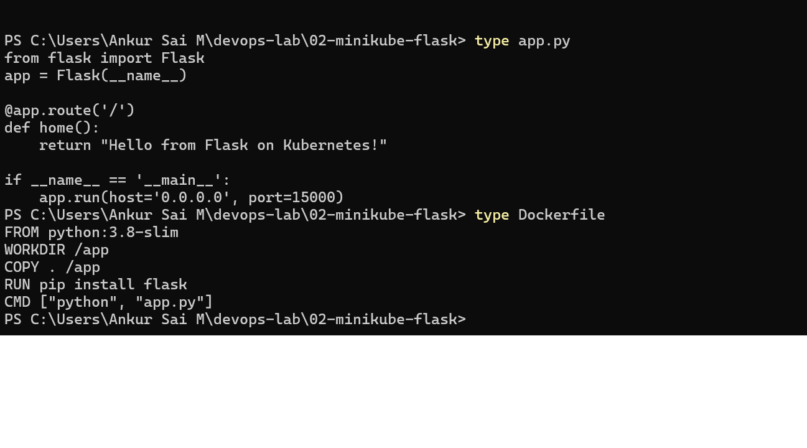

### 2. Build the image and load it into Minikube
`eval $(minikube docker-env)` did not work on Windows with the containerd runtime (SSH agent error), so I built the image with Docker Desktop and loaded it into Minikube with `minikube image load`.
```
docker build -t flask-app .
docker images flask-app
minikube image load flask-app:latest
minikube image ls
```
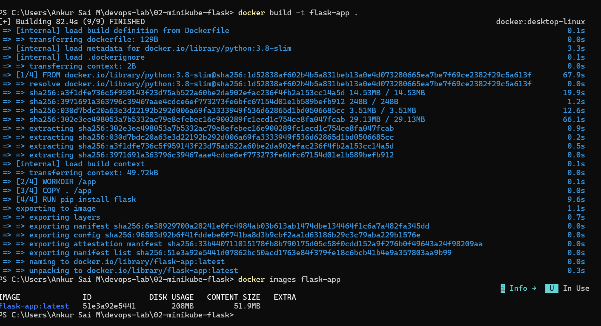
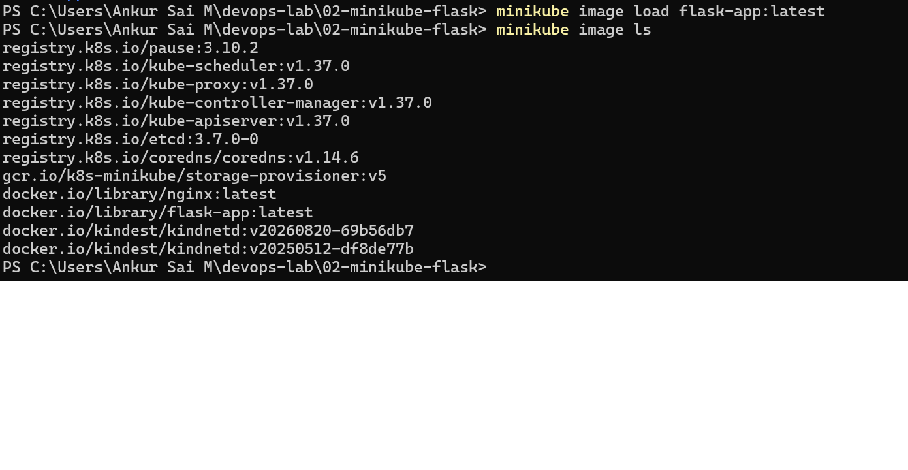

### 3. Deployment YAML
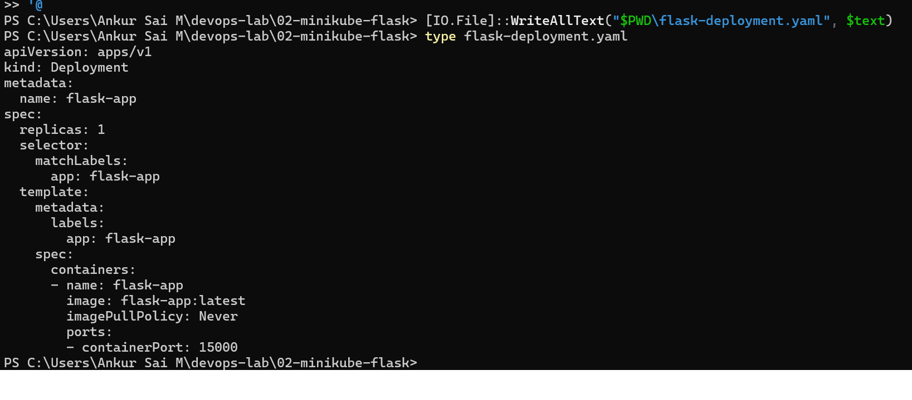

### 4. Deploy and verify
```
kubectl apply -f flask-deployment.yaml
kubectl get deployments
kubectl get pods -l app=flask-app
```
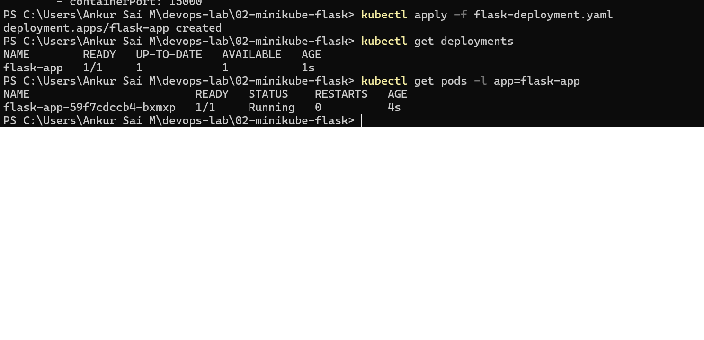

### 5. Describe the deployment
```
kubectl describe deployment flask-app
```
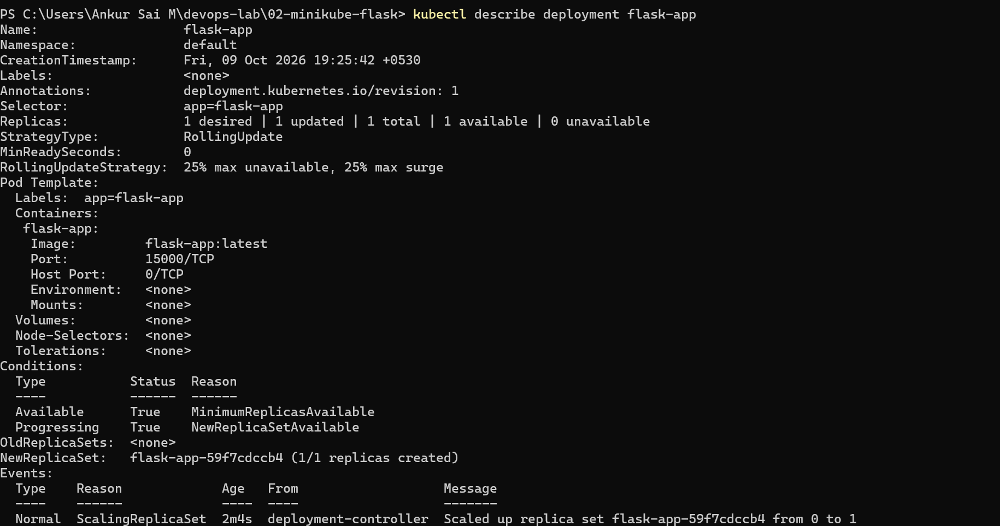

### 6. Logs
```
kubectl logs deployment/flask-app
```
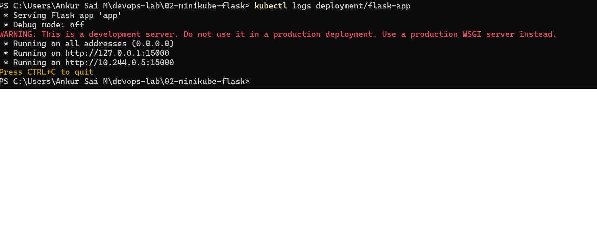

### 7. Without a Service, the app is not reachable
```
kubectl get services
curl.exe http://127.0.0.1:15000
```
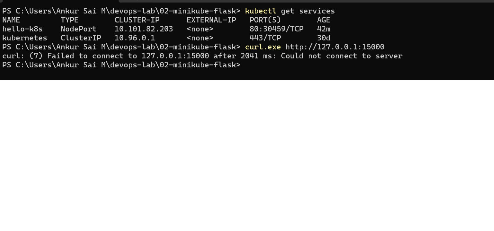

### 8. Add a NodePort Service
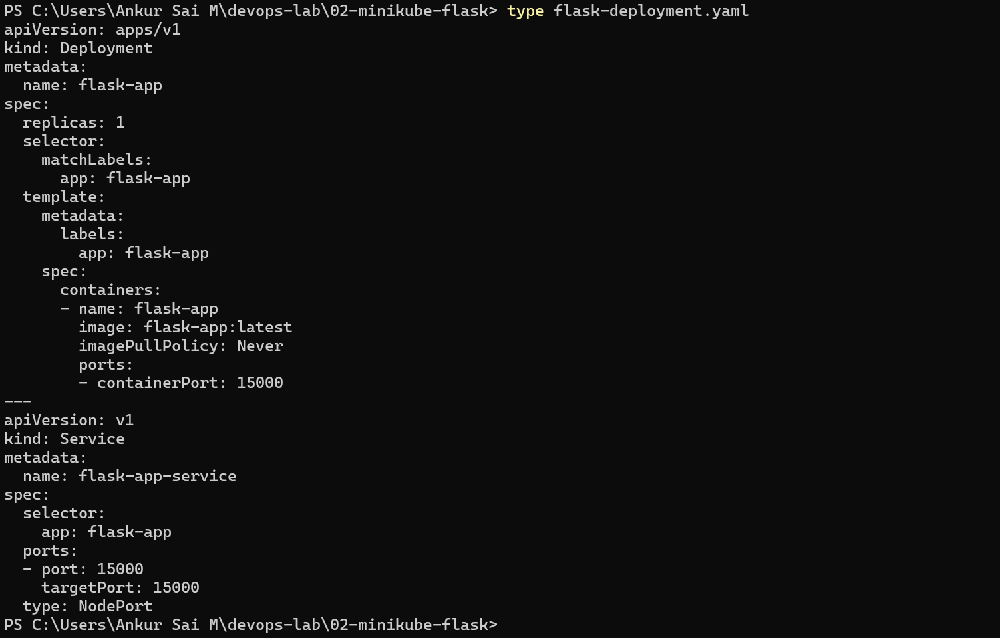
```
kubectl apply -f flask-deployment.yaml
kubectl get services
```
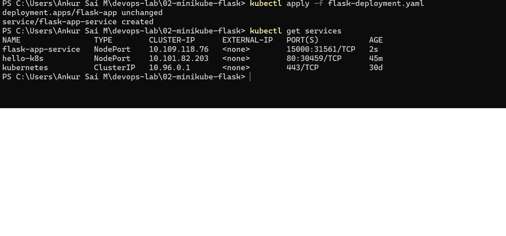

### 9. Access the app
```
minikube service flask-app-service --url
```
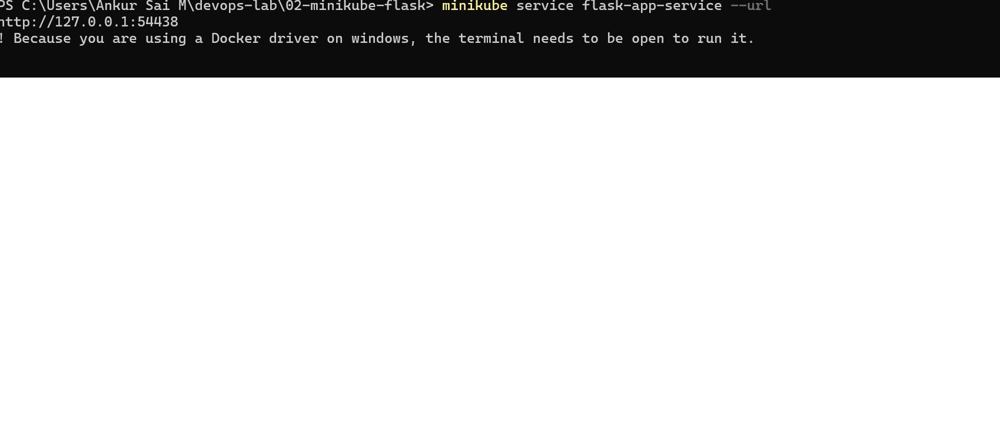
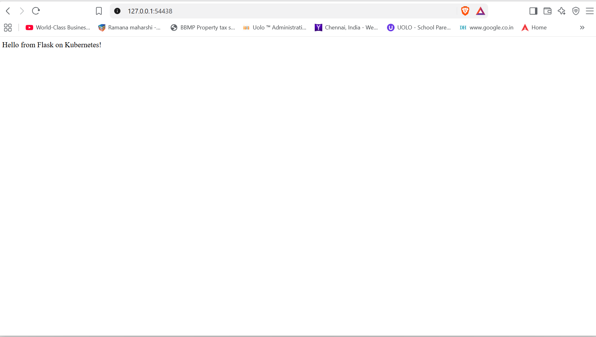
```
curl.exe http://127.0.0.1:54438
```
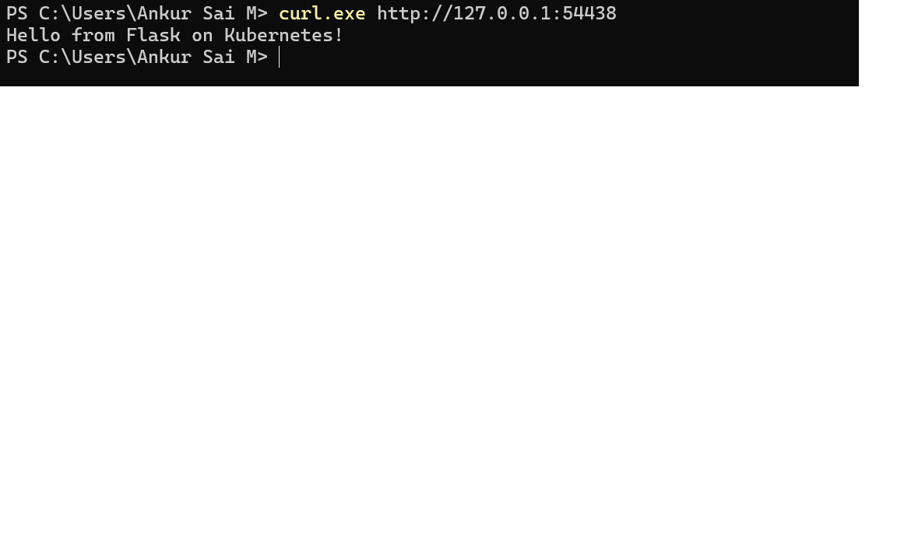

## What I learned
- `imagePullPolicy: Never` makes Kubernetes use only the local image, so the image must be inside Minikube.
- `port` is the port the Service exposes. `targetPort` is the port the container listens on.
- A Deployment keeps the pod running and recreates it if it dies. A Pod created with `kubectl run` is not recreated.
- A NodePort Service exposes the app on the node. With the Docker driver on Windows, `minikube service --url` creates a tunnel, so the terminal must stay open.

## Cleanup
```
kubectl delete -f flask-deployment.yaml
```