# Exercise 3: Scaling a Flask App on a Single Node using ReplicaSets

## Objective
Understand ReplicaSets and Pods, scale a Flask "flash sale" app, and observe how pods are distributed and self-healed on a single-node Minikube cluster.

## Environment
- Windows 11, Docker Desktop
- Minikube v1.39.0 (Docker driver, 1 node), kubectl v1.37.0

## Files
- `app.py`: Flask app with `/`, `/buy` and `/health`
- `Dockerfile`: python:3.11-slim image served with gunicorn on port 5000
- `flashsale-replicaset.yaml`: ReplicaSet (3 replicas, probes, resource limits) and a ClusterIP Service

## Steps

### 1. Fresh single-node cluster
```
minikube delete
minikube start --nodes=1 --driver=docker
kubectl get nodes
```
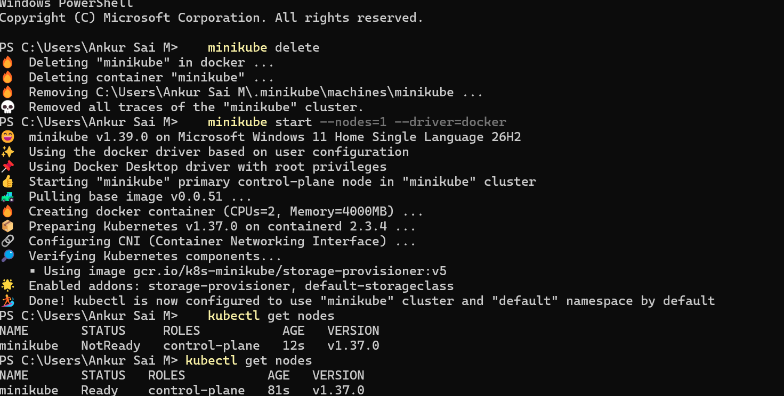

### 2. App and Dockerfile
The exercise's Dockerfile copied `ex3-flash-sale.py` while gunicorn runs `app:app`, so I saved the file as `app.py` and used `COPY app.py .`.

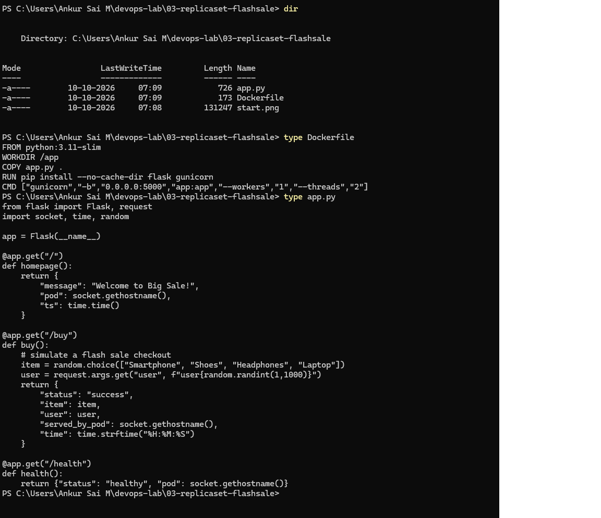

### 3. Build the image and load it into Minikube
I built the image locally and loaded it into Minikube with `minikube image load`, because `eval $(minikube docker-env)` does not work with the containerd runtime on Windows.
```
docker build -t flashsale:1.0 .
docker images flashsale
minikube image load flashsale:1.0
minikube image ls
```
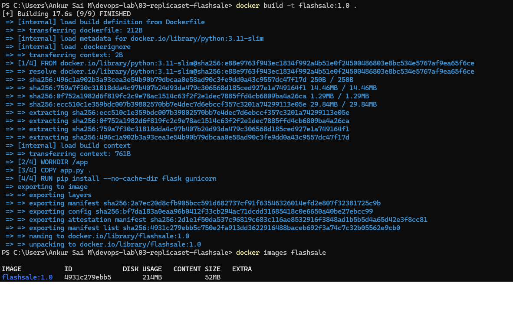
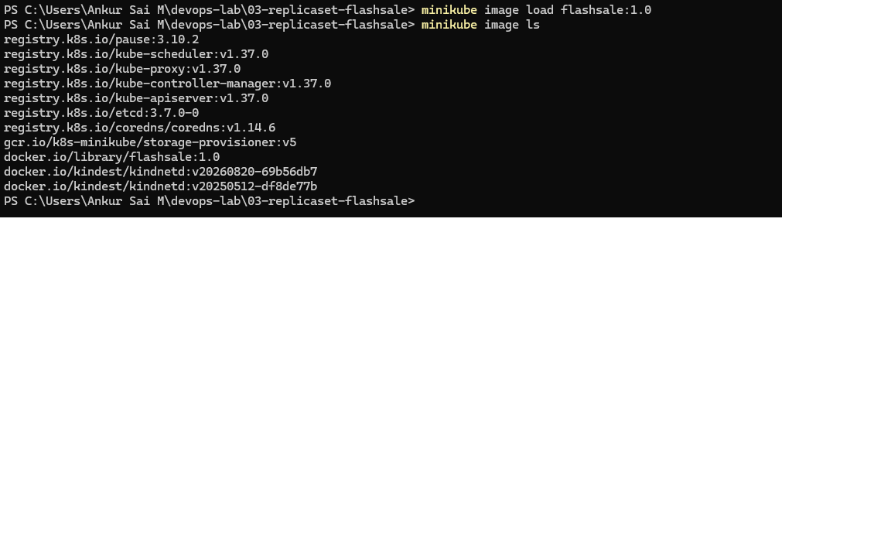

### 4. ReplicaSet and Service YAML
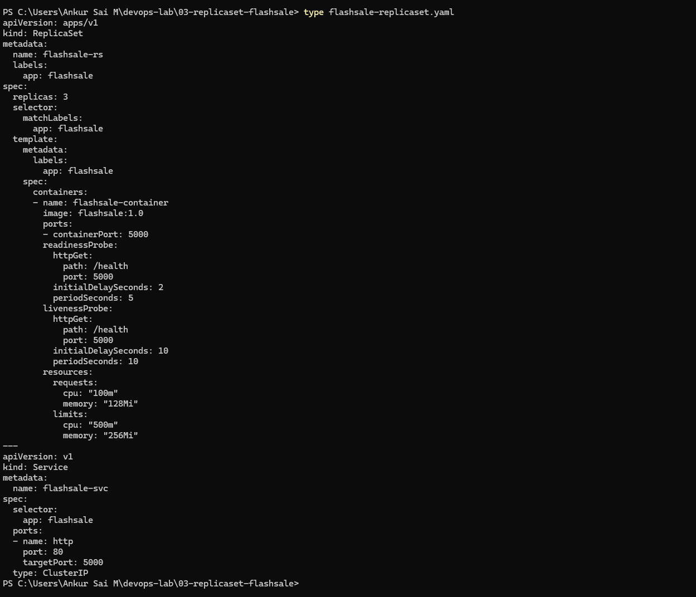

### 5. Apply and verify (3 replicas)
```
kubectl apply -f flashsale-replicaset.yaml
kubectl get rs
kubectl get pods
```
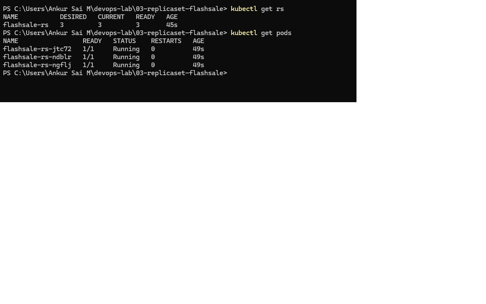

### 6. Scale to 5 replicas
The exercise used the name `flask-app-rs`; my ReplicaSet is `flashsale-rs`.
```
kubectl scale rs flashsale-rs --replicas=5
kubectl get rs
kubectl get pods
```
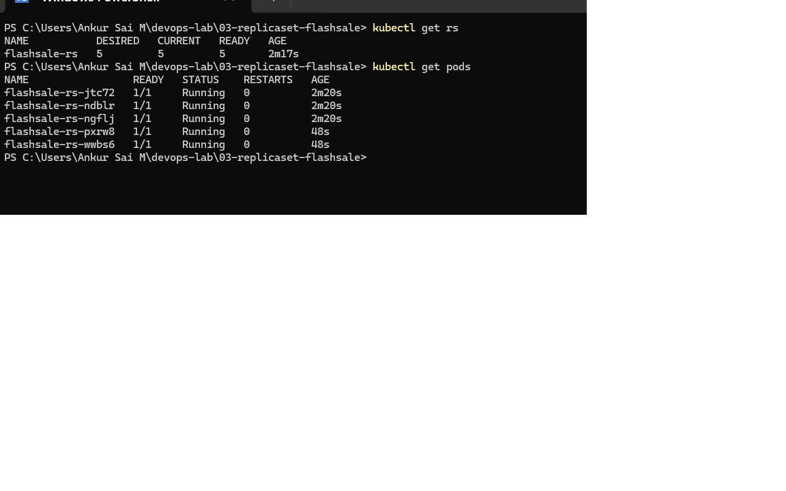

### 7. Delete a pod and watch it being replaced
```
kubectl delete pod flashsale-rs-jtc72
kubectl get pods
```
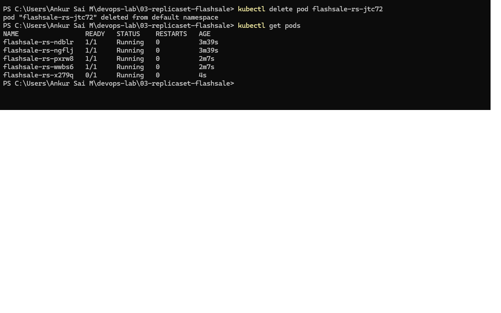

### 8. Pod distribution across nodes
```
kubectl get pods -o wide
```
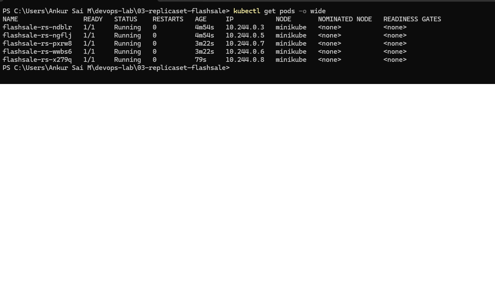

### 9. Describe the ReplicaSet
```
kubectl describe rs flashsale-rs
```
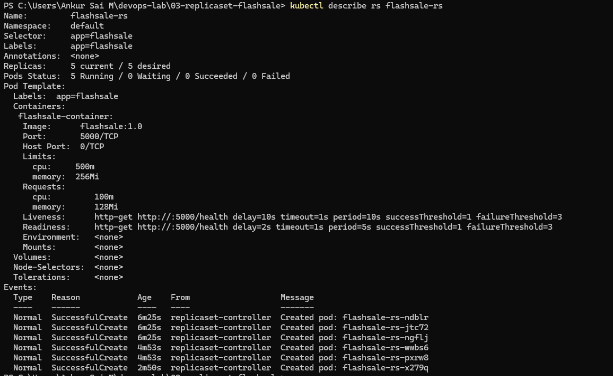

### 10. Load distribution across pods
The Service is ClusterIP, so I sent requests from a temporary pod inside the cluster.
```
kubectl run curl-test --rm -i --restart=Never --image=curlimages/curl --command -- sh -c 'for i in 1 2 3 4 5 6 7 8 9 10; do curl -s http://flashsale-svc/buy; echo; done'
```
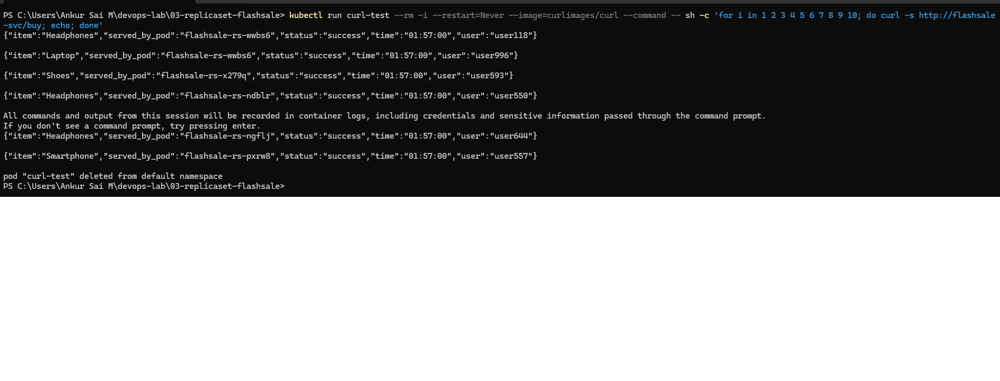

## Answers to the exercise questions
1. Initial replicas: 3
2. Pods running after applying: 3
3. Scaling to 5: Kubernetes creates 2 more pods so 5 are running.
4. Deleting a pod: the ReplicaSet immediately creates a replacement to keep 5 running.
5. Kubernetes keeps comparing the desired and current pod count and creates or deletes pods to match.
6. Nodes running: 1
7. All 5 pods run on the single node `minikube`.

## Docker Hub
The exercise also asks to publish the image. I tagged and pushed it to Docker Hub as `ankurgit/flashsale:1.0` (https://hub.docker.com/r/ankurgit/flashsale).
```
docker login
docker tag flashsale:1.0 ankurgit/flashsale:1.0
docker push ankurgit/flashsale:1.0
```
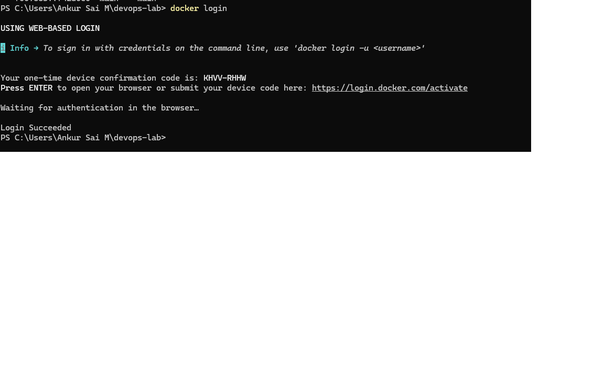
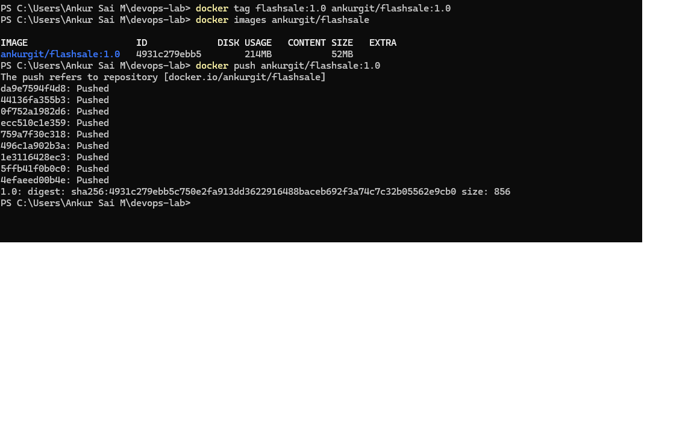
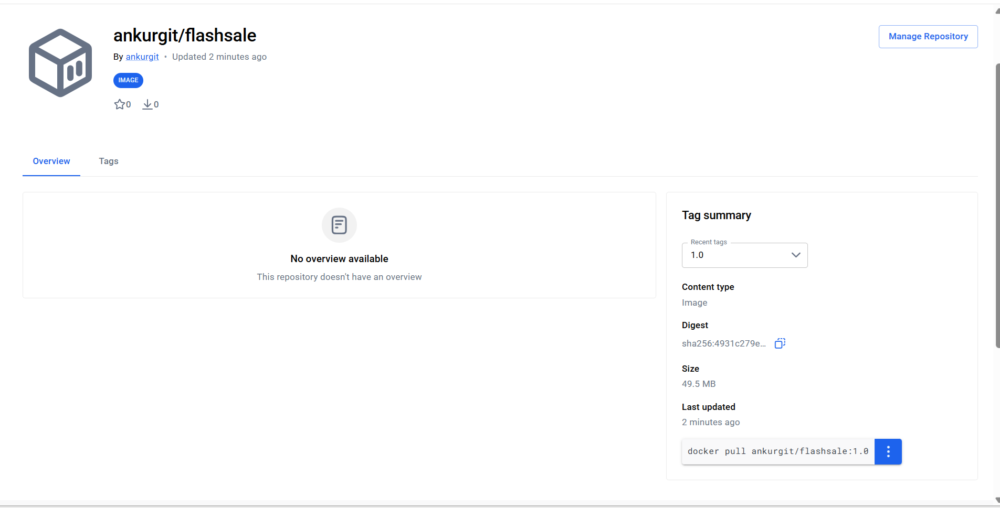
## What I learned
- A ReplicaSet keeps a fixed number of identical pods running and replaces any that are deleted or fail.
- Scaling is just changing the desired replica count. Pods are created or removed to match it.
- The Service load-balances requests across all ready pods, which the `served_by_pod` field shows.
- The readiness probe decides when a pod receives traffic. The liveness probe restarts a pod that stops responding.
- Resource requests are what the scheduler reserves for a pod. Limits are the maximum it can use.
- A Deployment manages ReplicaSets and adds rolling updates, so it is preferred over using a ReplicaSet directly.

## Cleanup
```
kubectl delete -f flashsale-replicaset.yaml
```