# Exercise 4: Docker Networking with Multiple Containers

## Objective
Build a three-container application (Flask API, MySQL, Redis) on a user-defined Docker bridge network, understand host-to-container port publishing, and show container-to-container DNS (service discovery).

## Environment
- Windows 11, Docker Desktop (Docker 29.7.2)
- Followed the lab walkthrough for this exercise, using PowerShell

## Files
- `app.py`: Flask API with a `/about` endpoint on port 5001
- `requirements.txt`: `Flask==2.0.1` and `Werkzeug==2.0.3`
- `Dockerfile`: python:3.9-slim image for the Flask app

## Architecture
```
Host (localhost:5001) -> flask container -> my-bridge-net -> mysql, redis
```
Only Flask is published to the host. MySQL and Redis are reachable only from inside the network.

## Steps

### 1. Verify Docker
```
docker --version
docker ps
docker info
```
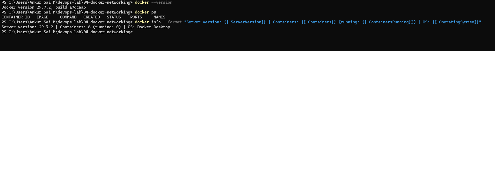

### 2. Create and inspect the bridge network
```
docker network create --driver bridge my-bridge-net
docker network ls
docker network inspect my-bridge-net
```
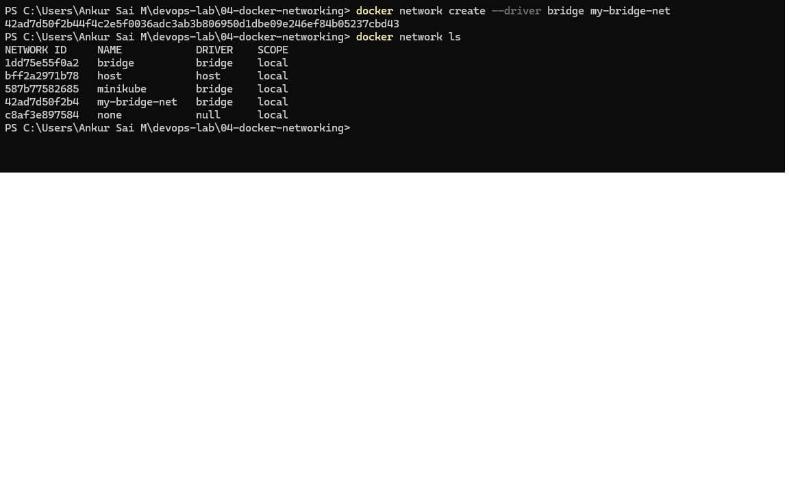
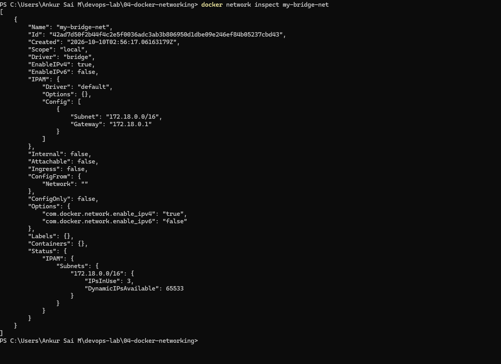

`"Containers"` is empty because nothing is attached yet.

### 3. Flask app, requirements and Dockerfile
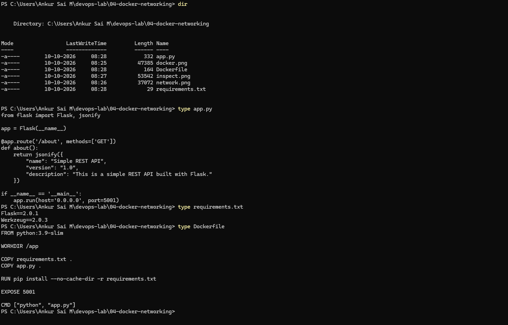

Points handled up front, as the walkthrough warns:
- `app.run(host='0.0.0.0', port=5001)`: Flask must listen on all interfaces. On the default `127.0.0.1` it is unreachable from outside the container.
- `Flask==2.0.1` fails with newer Werkzeug versions (`cannot import name 'url_quote'`), so Werkzeug is pinned to 2.0.3.
- The files were written with PowerShell to avoid the `requirements.txt.txt` problem.

### 4. Build the image and test it alone
```
docker build -t flask-api .
docker images
docker run -d --name flask-test -p 5001:5001 flask-api
curl.exe http://localhost:5001/about
```
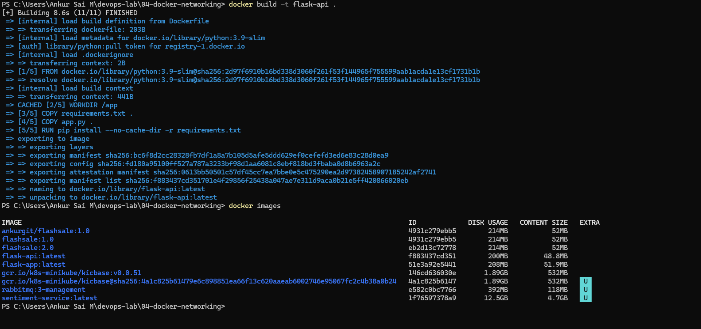
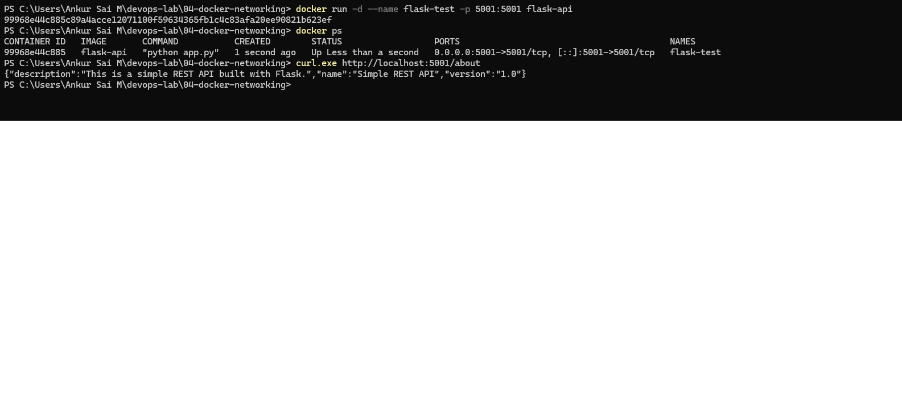

`curl.exe` is used on Windows because `curl` in PowerShell is an alias for `Invoke-WebRequest`.

### 5. Start MySQL and Redis on the network
```
docker rm -f flask-test
docker run -d --name mysql --network my-bridge-net -e MYSQL_ROOT_PASSWORD=rootpass -e MYSQL_DATABASE=devopsdb mysql:latest
docker run -d --name redis --network my-bridge-net redis:latest
docker ps
```
`rootpass` is a throwaway lab-only password from the lab walkthrough. The container is deleted in the cleanup step and no real credentials are used anywhere.

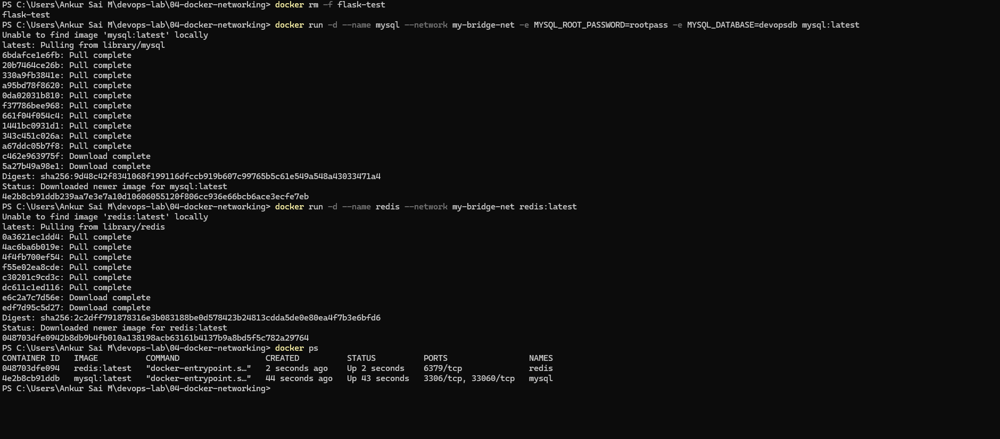

### 6. Network inspect after attaching the containers
```
docker network inspect my-bridge-net
```
`mysql` (172.18.0.2) and `redis` (172.18.0.3) now appear under `Containers`.

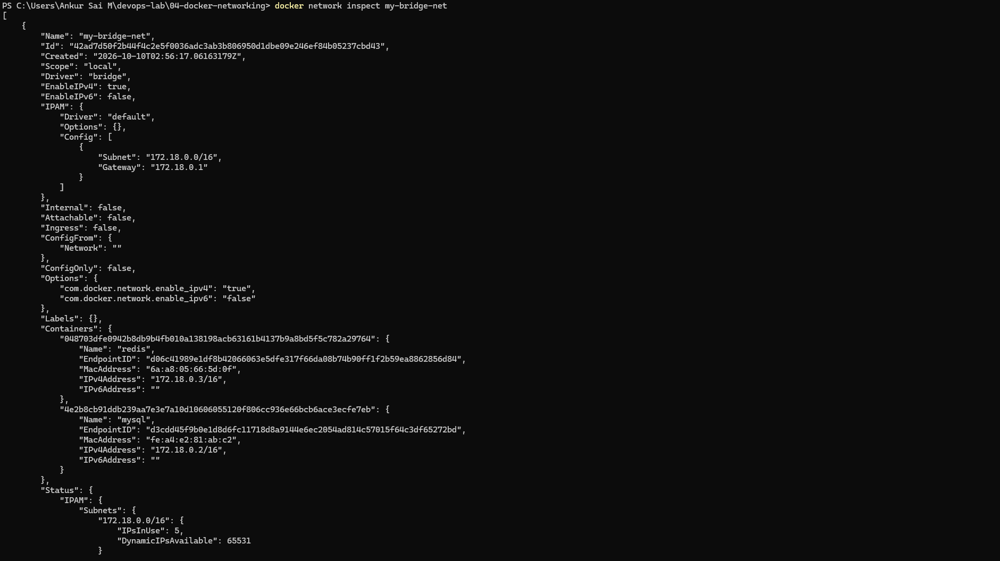

### 7. Start Flask on the same network
```
docker run -d --name flask --network my-bridge-net -p 5001:5001 flask-api
docker ps
curl.exe http://localhost:5001/about
```
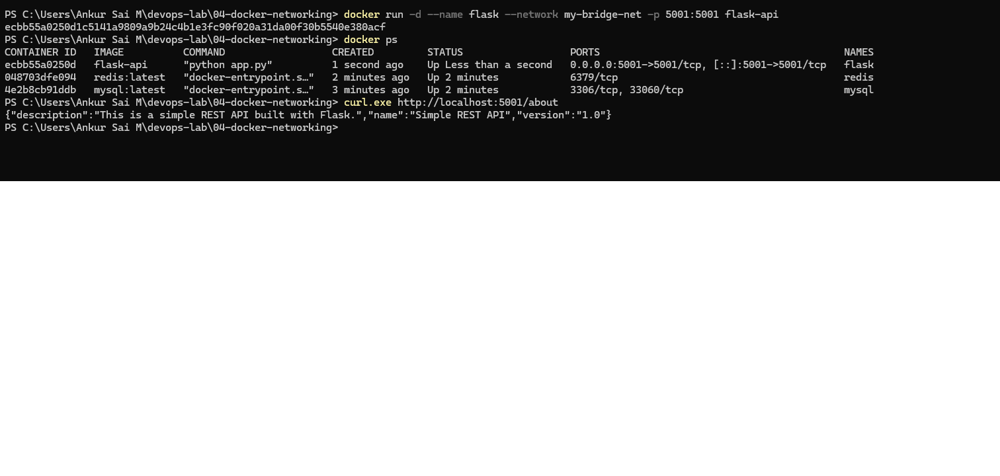

### 8. Container-to-container connectivity (DNS)
The slim Python image has no `ping`, so it was installed inside the running container.
```
docker exec flask sh -c "apt-get update -qq && apt-get install -y -qq iputils-ping > /dev/null 2>&1; ping -c 3 mysql; ping -c 3 redis"
docker exec flask getent hosts mysql
docker exec flask getent hosts redis
```
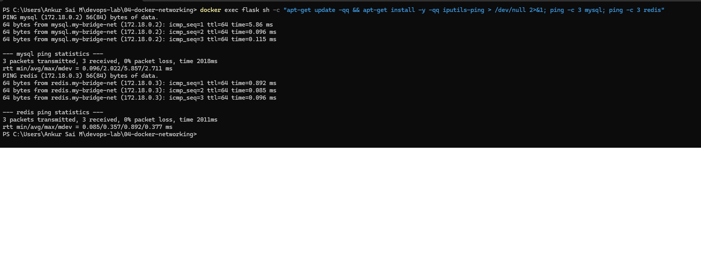
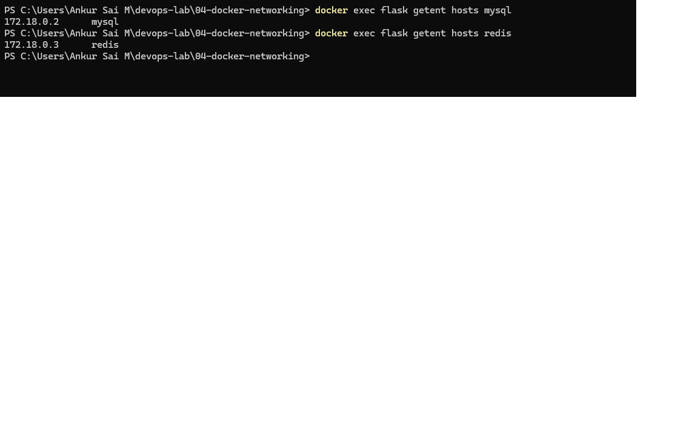

### 9. Check Redis and MySQL
```
docker exec -it redis redis-cli ping
docker exec -it mysql mysql -uroot -prootpass -e "SHOW DATABASES;"
```
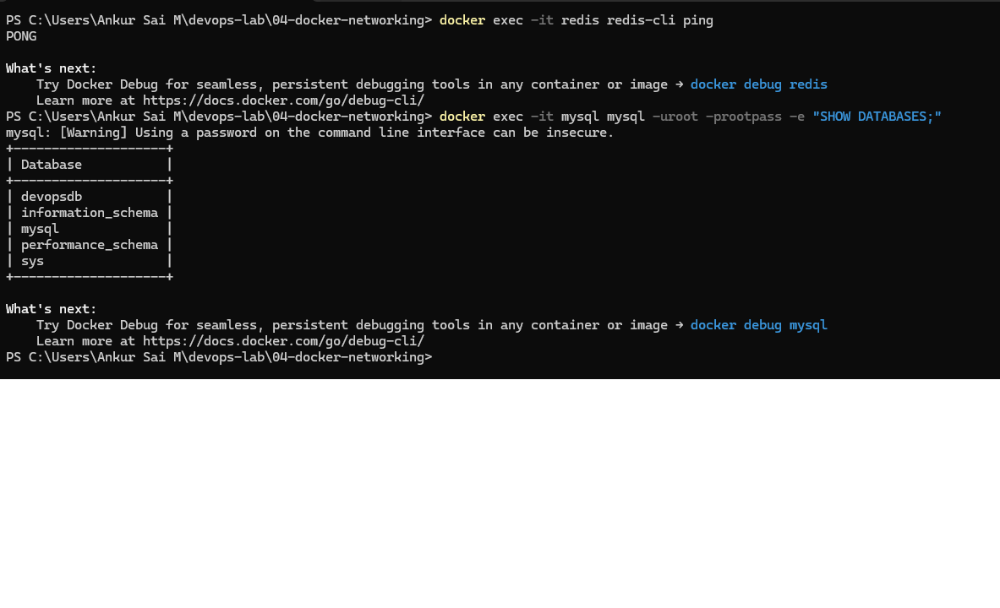

### 10. Final verification
```
docker ps
docker port flask
```
Only `flask` publishes a port (5001). `mysql` and `redis` show only their internal ports.

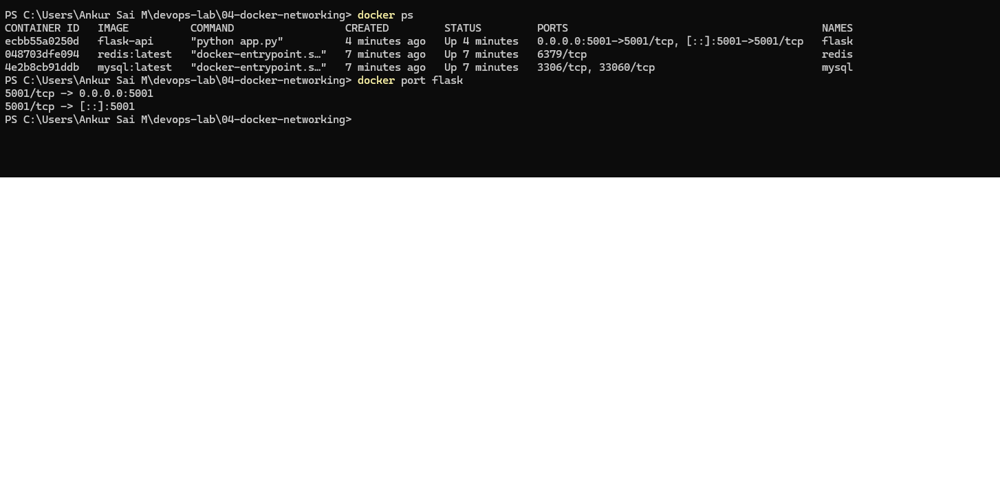

### 11. Cleanup
```
docker stop mysql redis flask
docker rm mysql redis flask
docker ps -a
docker network rm my-bridge-net
docker network ls
```
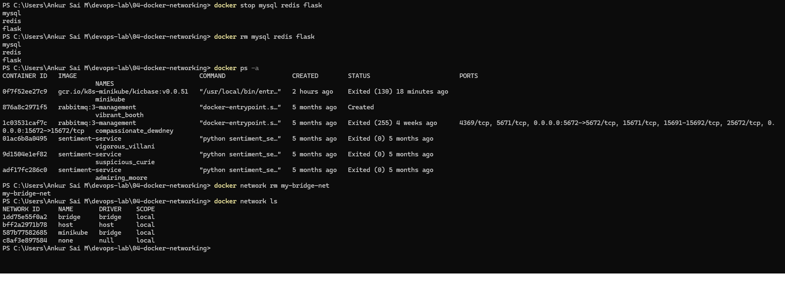

## Questions and answers
**What is the purpose of the `--net` flag in `docker run`?**
It specifies the Docker network the container connects to. The modern form is `--network`.

**How do containers communicate with each other on the same network?**
By container name or IP address. Names are preferred because IPs can change when a container is recreated. On a user-defined network, Docker's built-in DNS resolves the names.

**What is the difference between a bridge network and a host network?**
A bridge network gives each container its own network namespace, connected through Docker's virtual bridge, which isolates them from the host. A host network shares the host's network stack directly.

**How can you expose a container's port to the host machine?**
With `-p HOST_PORT:CONTAINER_PORT`, for example `-p 5001:5001`.

## What I learned
- A user-defined bridge network gives containers DNS-based service discovery, so Flask reaches `mysql` and `redis` by name without hard-coded IPs.
- A published port (`-p`) is the entry point from outside the network. Containers on the same network do not need published ports to talk to each other.
- A Flask app inside a container must bind to `0.0.0.0`, not `127.0.0.1`.
- Pinning dependency versions (Flask 2.0.1 with Werkzeug 2.0.3) avoids build and runtime surprises.