# Exercise 5: Docker Security with AppArmor and Python

## Objective
Secure a Flask container with an AppArmor profile, apply it with the Docker SDK for Python, and test restricted actions (reading /etc/passwd, running /bin/bash).

## Files
| File | Purpose |
|---|---|
| app.py | Flask app on port 5000 |
| Dockerfile | python:3.8-slim image, image name flask-apparmor |
| my-apparmor-profile | AppArmor profile used by the exercise |
| apply_apparmor.py | Task 4: builds, runs with the profile, inspects SecurityOpt |
| test_restricted_actions.py | Task 5: tries cat /etc/passwd and /bin/bash in the container |

## Environment
- Windows 11 with Docker Desktop (WSL2): AppArmor not available
- GitHub Codespace (Ubuntu): AppArmor kernel module enabled, used for the profile and Docker tests
- Docker SDK for Python 7.2.0

## Part 1: Windows cannot run this exercise
`docker info` on Docker Desktop shows only seccomp and cgroupns, with no apparmor.

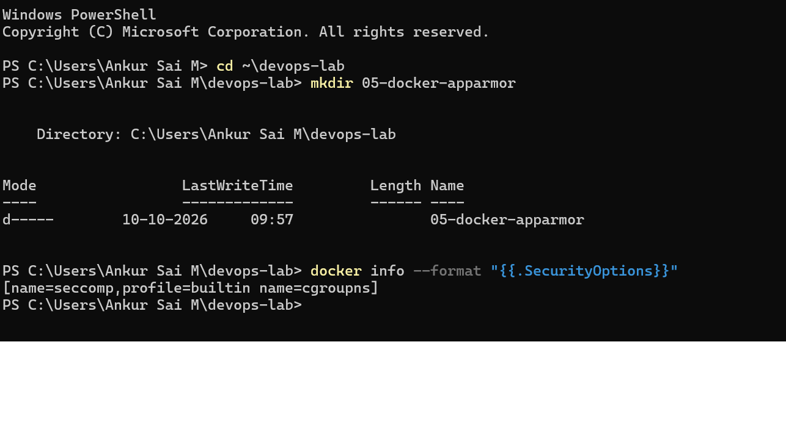

A container started with a profile that does not exist still ran, `cat /etc/passwd` worked, and `AppArmorProfile` was empty even though `SecurityOpt` listed the request.

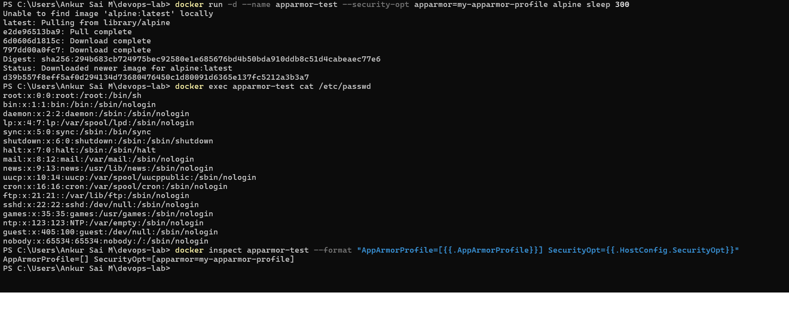

Cause: Docker Desktop runs containers on the WSL2 kernel, which has no AppArmor support. Installing apparmor-utils only adds the tools, not the kernel feature.

I also tried an Ubuntu VM with Multipass and VirtualBox. It started but never got a network address, and `multipass shell` failed with "ssh connection failed: Timeout connecting to 127.0.0.1". I stopped and moved to a GitHub Codespace.

## Part 2: AppArmor in a Codespace
The kernel module is enabled, the tools were missing at first (`aa-status: command not found`) and were fixed with `sudo apt-get install apparmor-utils`. Docker reports apparmor in its security options.

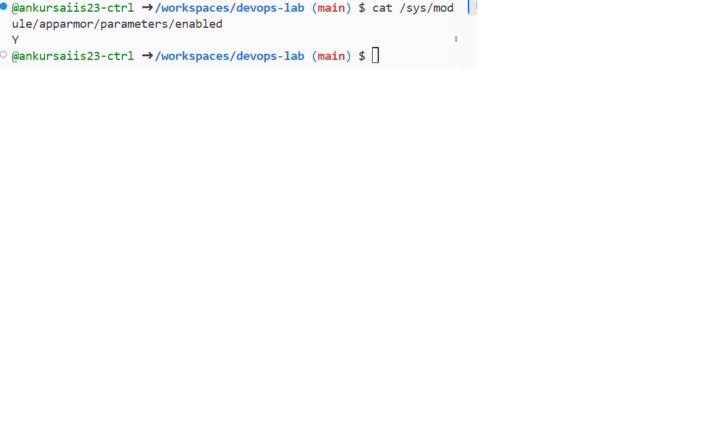
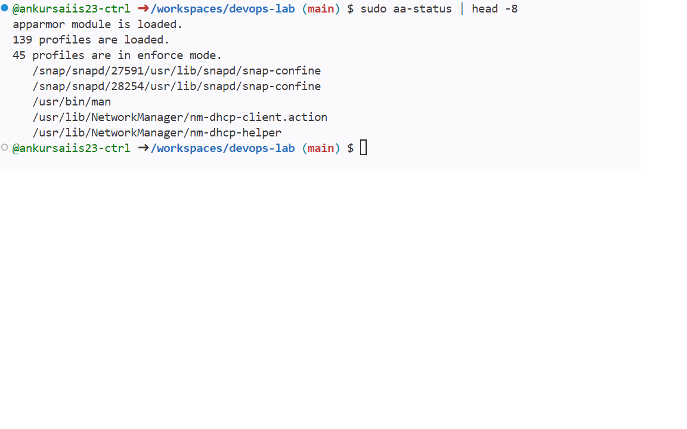
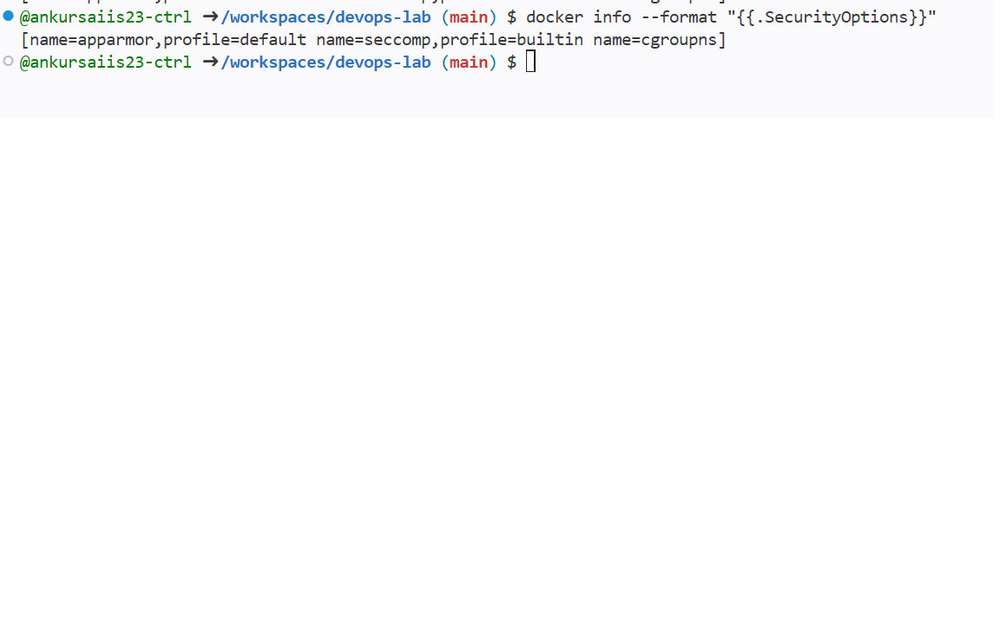
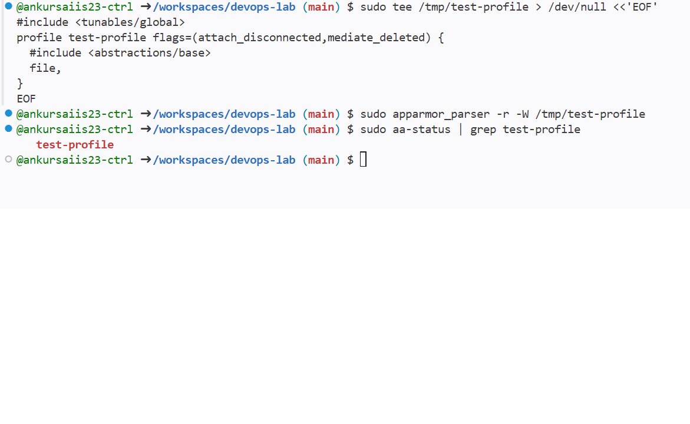

## Part 3: Tasks 1 to 3 (app, image, profile)
Image built as flask-apparmor.

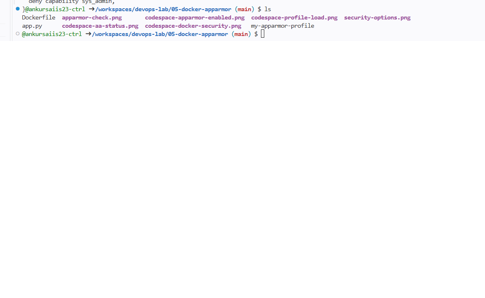
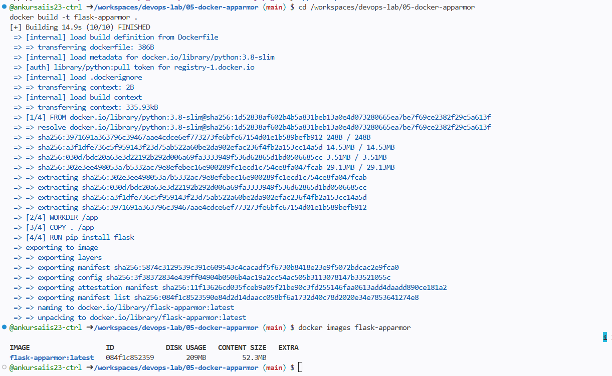

### Profile problems I diagnosed
1. The profile in the exercise is named /usr/bin/python3, but Docker is told apparmor=my-apparmor-profile. The name must match, so I wrote `profile my-apparmor-profile`.
2. AppArmor denies anything not listed, so I added a baseline (network, capability, file) so Python can run. Deny rules take priority over allow rules.
3. `deny /usr/bin/** rmix` would block `cat` itself, so I denied only the shells.
4. The parser rejected my first version at line 19: "Invalid perms, in deny rules 'x' must not be preceded by exec qualifier". `rmix` contains `i`. I changed the deny rules to `deny /bin/bash x,` and so on, and the profile loaded.

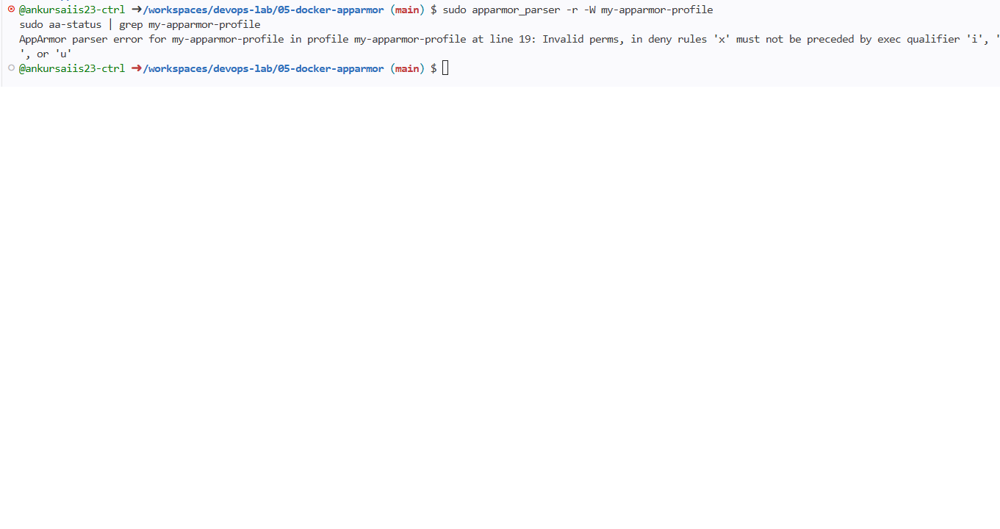
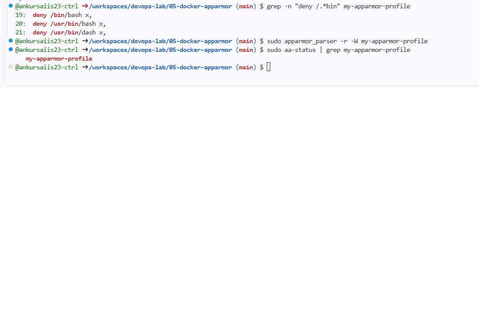

The container started and served the page. My first curl failed with "Connection reset by peer" because I ran it less than a second after starting the container. With a 3 second wait it worked.

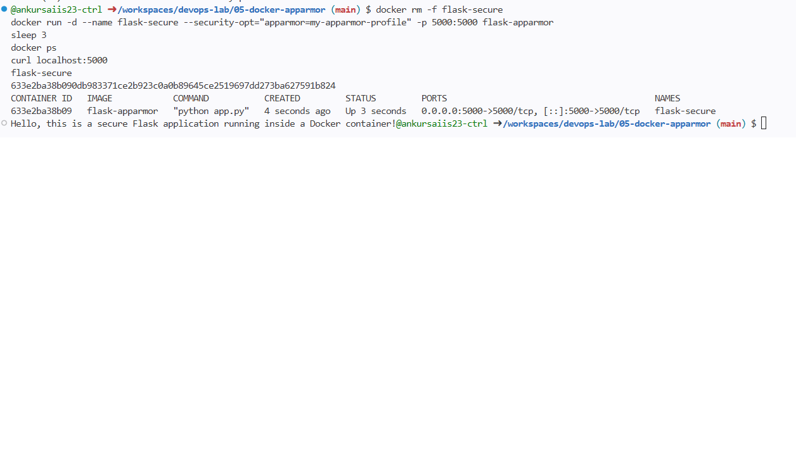
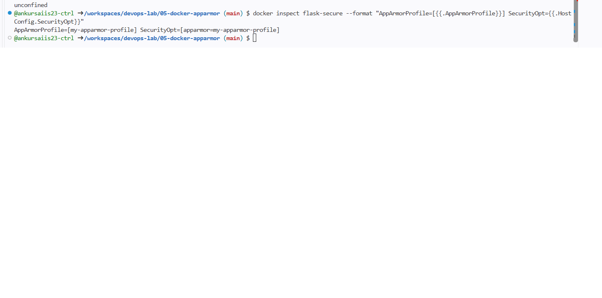

## Part 4: Is the profile actually enforced?
`docker inspect` shows the profile in HostConfig.SecurityOpt, but that only shows it was requested.

| Test | Expected | Result in Codespace |
|---|---|---|
| cat /etc/passwd in container | Exit 1 | Exit 0, file printed |
| /bin/bash in container | Exit 126 | Exit 0 |
| Container started with a non-existent profile | Docker error | Started normally |
| Container /proc/self/attr/current | profile (enforce) | unconfined |
| `sudo aa-exec -p my-apparmor-profile cat /etc/passwd` | Exit 1 | Permission denied, exit 1 |

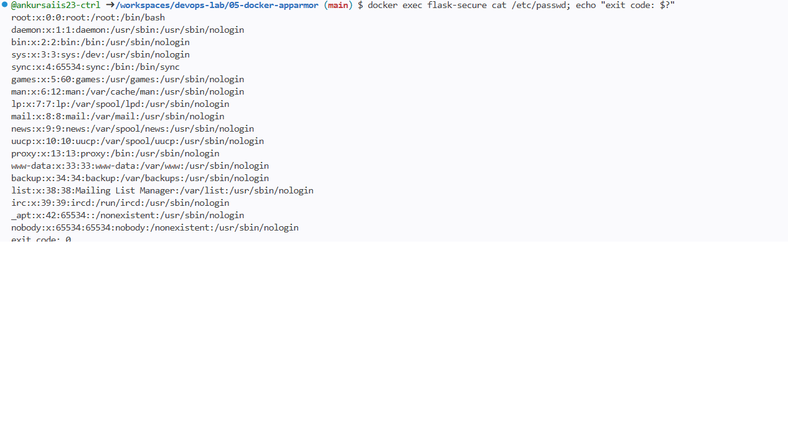
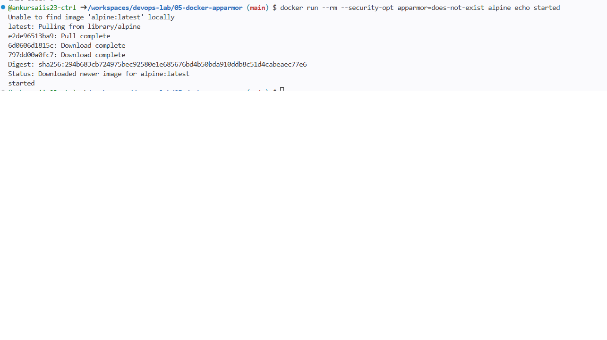
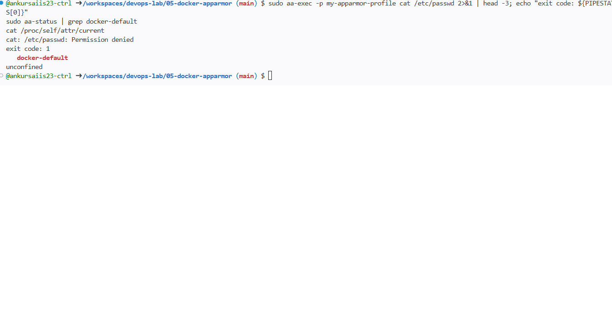
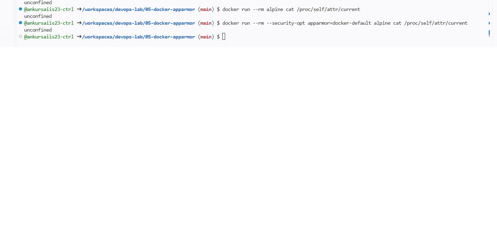

Conclusion: the profile is correct, because the kernel blocks /etc/passwd when the profile is applied with aa-exec. In this Codespace, Docker does not apply AppArmor profiles to containers, so even docker-default runs unconfined. I did not verify the reason. A likely cause is the nested Docker setup in Codespaces.

### Tasks 4 and 5 output
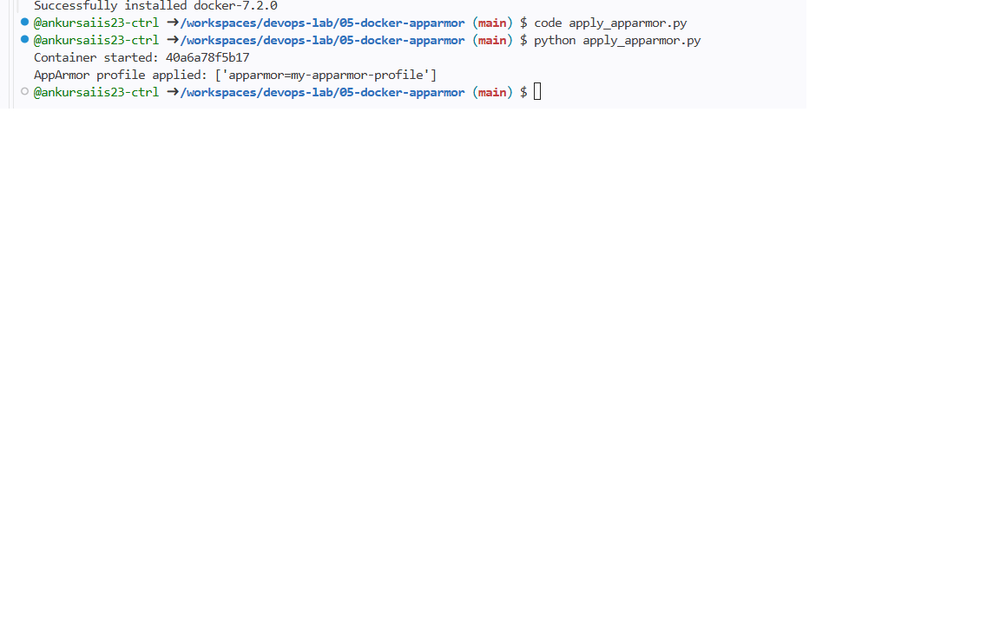
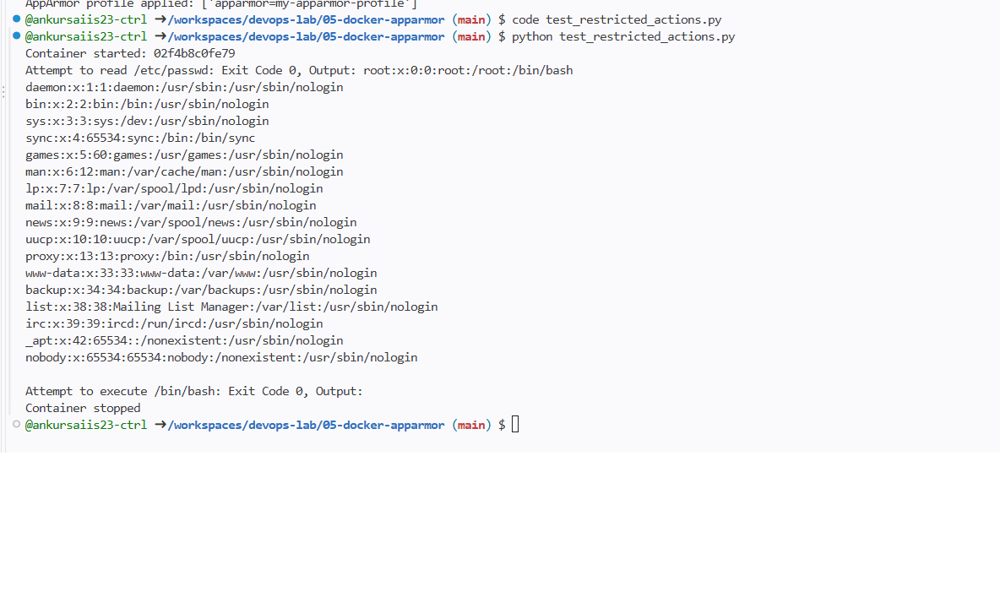

Task 4 matches the expected output. Task 5 does not (exit codes 0 and 0 instead of 1 and 126) for the reason above.

## Questions
1. **Purpose of AppArmor with Docker:** it confines a container to a limited set of files, network access and capabilities, as an extra layer beyond namespaces.
2. **How profiles secure a container:** a profile lists what the process may read, write, execute or use, and the kernel denies the rest, so a compromised app is limited.
3. **Why restrict /etc and /var:** they hold system configuration and user data, so reading or changing them can lead to further compromise.
4. **Other things to restrict:** network access, binding ports, executing binaries, writing to directories and capabilities such as sys_admin.
5. **Verifying a profile is applied:** `docker inspect` (HostConfig.SecurityOpt), plus a real test such as reading a denied file, or checking /proc/self/attr/current inside the container.

## What I learned
- AppArmor is a Linux kernel feature that limits what a process can read, write, execute or use. A Docker container can be given a profile with --security-opt apparmor=<name>, which adds a layer of protection beyond normal container isolation.
- AppArmor needs kernel support, and installing apparmor-utils only adds the tools. Docker Desktop on Windows runs on the WSL2 kernel, which has none, so the exercise could not run there. Docker even accepted a profile that did not exist, which hides the problem.
- The profile in the exercise needed fixes. The name must match what Docker is given, it needs a baseline of allowed access, and the parser rejects "rmix" in a deny rule, so I used "x".
- docker inspect only shows that a profile was requested. To know it is enforced, I had to try a blocked action and check /proc/self/attr/current. Here the kernel blocked /etc/passwd through aa-exec, but Docker in the Codespace ran containers unconfined, so Task 5 gave exit codes 0 and 0 instead of 1 and 126.
- Checking each layer (kernel, profile, Docker) separately let me find where the problem was instead of guessing.